# Zen MCP Server - Migration Strategy

## Executive Summary

This document outlines the **phased hybrid migration strategy** chosen for transitioning from the current Tool/Registry architecture to the future LangGraph multi-agent system. This approach preserves functionality while enabling gradual adoption.

## Strategy Decision: Phased Hybrid Migration

### Rationale for Hybrid Approach

1. **Risk Mitigation**: Maintains production stability during transition
2. **User Choice**: Allows users to select architecture based on needs
3. **Incremental Development**: Enables testing and feedback at each phase
4. **Resource Efficiency**: Reuses existing tool investments in LangGraph nodes
5. **Rollback Capability**: Easy fallback to stable system if issues arise

## Migration Phases

### Phase 1: Alignment & Documentation ✅ COMPLETE
**Timeline**: Immediate (Completed)
**Goal**: Eliminate confusion, establish clear direction

**Completed Tasks**:
- ✅ Architecture analysis and misalignment identification
- ✅ Hybrid approach decision and documentation
- ✅ README.md alignment with current reality
- ✅ Configuration guide creation
- ✅ Project status tracking system
- ✅ Migration path documentation

**Deliverables**:
- [`docs/ARCHITECTURE_ALIGNMENT.md`](docs/ARCHITECTURE_ALIGNMENT.md)
- [`docs/PROJECT_STATUS.md`](docs/PROJECT_STATUS.md)
- [`docs/MIGRATION_GUIDE.md`](docs/MIGRATION_GUIDE.md)
- [`docs/CONFIGURATION_GUIDE.md`](docs/CONFIGURATION_GUIDE.md)
- Updated [`README.md`](README.md)

### Phase 2: Parallel Operation 🔄 IN PROGRESS
**Timeline**: Next 1-2 months
**Goal**: Both architectures available, users can choose based on needs

#### 2.1: LangGraph Node Implementation (Priority: High)

**Current Status**:
- ✅ Supervisor node (routing logic, LLM integration)
- ✅ Researcher node (basic LLM calls)
- ⏳ Architect node (placeholder)
- ⏳ Coder node (placeholder)
- ⏳ Reviewer node (placeholder)
- ⏳ Debugger node (placeholder)
- ⏳ Terminal node (placeholder)
- ⏳ Utilities node (placeholder)

**Implementation Plan**:

```mermaid
graph TD
    A[Supervisor ✅] --> B[Researcher ✅]
    A --> C[Architect 🔄]
    A --> D[Coder ⏳]
    A --> E[Reviewer ⏳]
    A --> F[Debugger ⏳]
    A --> G[Terminal ⏳]
    A --> H[Utilities ⏳]
    
    C --> I[analyze + refactor tools]
    D --> J[chat + planner tools]
    E --> K[codereview + secaudit + precommit]
    F --> L[debug + tracer tools]
    G --> M[NEW: SSH/CLI capabilities]
    H --> N[listmodels + version tools]
```


#### 2.2: Tool Integration Strategy

**Approach**: Wrap existing sophisticated tools as LangGraph node implementations

**Benefits**:
- ✅ Preserves years of tool development investment
- ✅ Leverages existing workflow capabilities
- ✅ Maintains conversation memory and expert analysis
- ✅ Reuses comprehensive testing

**Implementation Pattern**:
```python
# Example: Architect node implementation
def architect_node(state: AgentState) -> dict:
    """Architect node using existing analyze/refactor tools"""
    # Extract task from state
    task = extract_task_from_state(state)
    
    # Use existing tools with LangGraph state management
    if task.type == "analysis":
        tool = AnalyzeTool()
        result = await tool.execute(task.parameters)
    elif task.type == "refactoring":
        tool = RefactorTool()
        result = await tool.execute(task.parameters)
    
    # Convert tool output to LangGraph state format
    return {"messages": [format_message_for_langgraph(result)]}
```

#### 2.3: Testing & Validation

**Test Strategy**:
1. **Unit Tests**: Each node in isolation
2. **Integration Tests**: Node-to-node communication
3. **Workflow Tests**: End-to-end agent orchestration
4. **Performance Tests**: Compare with tool system benchmarks
5. **Compatibility Tests**: Ensure feature parity

**Success Criteria**:
- All 7 nodes implemented with core functionality
- 90% feature parity with tool system
- Performance within 20% of tool system
- Comprehensive test coverage (>80%)

### Phase 3: Unified Entry Point ⏳ PLANNED
**Timeline**: Next 3-6 months
**Goal**: Single server with architecture selection

#### 3.1: Architecture Selection Mechanism

**Environment-Based Selection**:
```bash
# User choice via environment variable
ZEN_ARCHITECTURE=tools     # Current system (default)
ZEN_ARCHITECTURE=langgraph  # Future system
ZEN_ARCHITECTURE=auto        # Smart selection based on task
```

**Runtime Selection**:
```python
# Unified server entry point
def create_server():
    architecture = os.getenv('ZEN_ARCHITECTURE', 'tools')
    
    if architecture == 'langgraph':
        return create_langgraph_server()
    elif architecture == 'auto':
        return select_architecture_automatically()
    else:
        return create_tools_server()
```

#### 3.2: Feature Flagging System

**Gradual Feature Rollout**:
```python
# Feature flags for smooth transition
FEATURE_FLAGS = {
    'langgraph_enabled': False,  # Gradual rollout
    'conversation_memory_v2': False,  # Enhanced memory
    'unified_gateway': False,  # Gateway integration
    'redis_persistence': False,  # State persistence
}
```

#### 3.3: Migration Assistance Tools

**Automated Migration**:
```python
# Migration helper for user data
def migrate_conversation_history():
    """Migrate conversation memory from tools to LangGraph"""
    # Convert conversation threads to Redis format
    # Preserve context and continuity
    # Validate migration integrity
```

### Phase 4: Gradual Transition ⏳ PLANNED
**Timeline**: Next 6-12 months
**Goal**: Complete migration to LangGraph architecture

#### 4.1: User Migration Programs

**Early Adopter Program**:
- Beta access to LangGraph features
- Direct support for migration issues
- Influence on development priorities
- Recognition and rewards for feedback

**Enterprise Migration Support**:
- Dedicated migration specialists
- Custom integration assistance
- Training programs for teams
- SLA support during transition

#### 4.2: Legacy Deprecation Planning

**Deprecation Timeline**:


## Risk Management

### High-Risk Areas

1. **Feature Parity Gap**
   - **Risk**: LangGraph system may lack tool system features
   - **Mitigation**: Systematic feature mapping and testing
   - **Contingency**: Delay deprecation until parity achieved

2. **Performance Regression**
   - **Risk**: LangGraph system slower than tool system
   - **Mitigation**: Performance benchmarks and optimization
   - **Contingency**: Performance tuning before rollout

3. **User Adoption Resistance**
   - **Risk**: Users prefer familiar tool system
   - **Mitigation**: Migration assistance and benefits communication
   - **Contingency**: Extended parallel operation period

### Medium-Risk Areas

1. **Complexity Increase**
   - **Risk**: Dual architecture harder to maintain
   - **Mitigation**: Shared components and automated testing
   - **Contingency**: Dedicated maintenance teams

2. **Resource Requirements**
   - **Risk**: LangGraph requires Redis and gateway
   - **Mitigation**: Docker deployment and documentation
   - **Contingency**: Simplified deployment options

## Success Metrics

### Technical Metrics

- **Feature Parity**: 95% of tool system features in LangGraph
- **Performance**: Within 15% of tool system response times
- **Reliability**: 99.9% uptime for both architectures
- **Test Coverage**: >85% for LangGraph system

### User Metrics

- **Adoption Rate**: 60% of active users on LangGraph within 6 months
- **Satisfaction Score**: >4.5/5 for migration experience
- **Support Tickets**: <20% increase during transition
- **Migration Success**: >90% successful user migrations

### Business Metrics

- **Development Velocity**: 25% faster feature development in LangGraph
- **Maintenance Cost**: 30% reduction after full migration
- **User Retention**: >95% during transition period
- **Community Engagement**: 50% increase in contributions

## Decision Points & Triggers

### Go/No-Go Decisions

#### Phase 2 Completion Criteria
- **Go**: All nodes implemented with >80% feature parity
- **No-Go**: Continue development until criteria met

#### Phase 3 Initiation Trigger
- **Go**: Phase 2 complete + user demand for unified system
- **No-Go**: Extend parallel operation until ready

#### Phase 4 Initiation Trigger
- **Go**: Unified system stable + positive user feedback
- **No-Go**: Address issues before transition

### Rollback Triggers

- **Critical Bug**: Security vulnerability or data loss
- **Performance Issue**: >50% performance regression
- **User Feedback**: >70% negative feedback on new system
- **Adoption Rate**: <20% after 3 months of availability

## Communication Plan

### Internal Communication

1. **Development Team**: Weekly migration status meetings
2. **Stakeholders**: Monthly progress reports
3. **Support Team**: Training on both architectures
4. **Documentation**: Real-time updates to guides

### External Communication

1. **Blog Posts**: Major phase announcements
2. **Documentation**: Updated guides and tutorials
3. **Community**: GitHub discussions and feedback collection
4. **Support**: Migration assistance and troubleshooting

## Resource Requirements

### Development Resources

- **Core Team**: 2-3 developers for LangGraph implementation
- **Testing**: 1 QA engineer for validation
- **Documentation**: 1 technical writer
- **Support**: 1 migration specialist

### Infrastructure Resources

- **Development**: Redis and gateway instances
- **Testing**: Automated testing environments
- **Staging**: User acceptance testing setup
- **Production**: High-availability deployment

### Timeline Resources

- **Phase 2**: 2 months full-time development
- **Phase 3**: 3 months part-time development
- **Phase 4**: 6 months gradual rollout
- **Buffer**: 1 month contingency per phase

---

*This strategy balances innovation with stability, ensuring a smooth transition for all users while advancing the architecture toward future goals.*